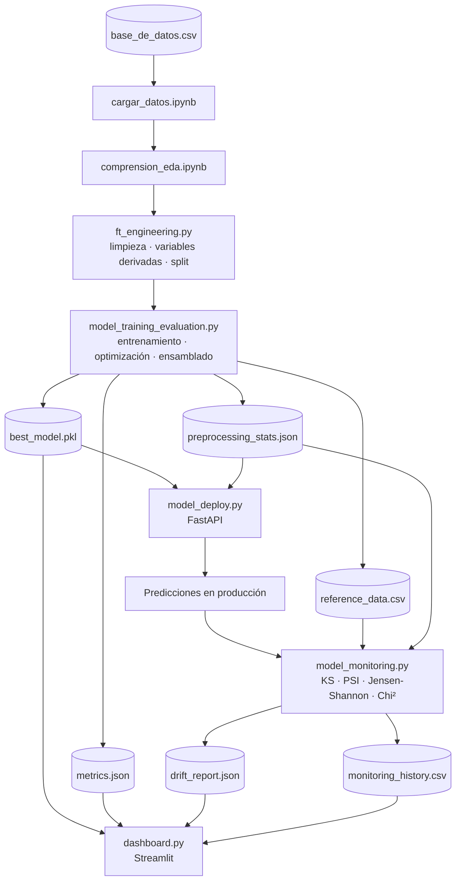

# 📊 Credit Risk MLOps Pipeline

**Pipeline de Machine Learning end-to-end para la predicción del comportamiento crediticio de nuevos clientes**, desarrollado como proyecto integrador para una empresa financiera ficticia. Cubre el ciclo completo: carga y limpieza de datos, EDA, ingeniería de variables, entrenamiento y selección automática de modelos, despliegue como API REST, monitoreo de drift y un dashboard operativo.


---

## 📑 Índice

- [Descripción del proyecto](#-descripción-del-proyecto)
- [Objetivos](#-objetivos)
- [Contexto empresarial](#-contexto-empresarial)
- [Arquitectura](#-arquitectura)
- [Stack tecnológico](#-stack-tecnológico)
- [Estructura del repositorio](#-estructura-del-repositorio)
- [Instalación](#-instalación)
- [Ejecución](#-ejecución)
- [Dataset](#-dataset)
- [Limpieza y análisis exploratorio](#-limpieza-y-análisis-exploratorio)
- [Ingeniería de variables (`ft_engineering.py`)](#-ingeniería-de-variables-ft_engineeringpy)
- [Entrenamiento y selección de modelos (`model_training_evaluation.py`)](#-entrenamiento-y-selección-de-modelos-model_training_evaluationpy)
- [Artefactos generados](#-artefactos-generados)
- [Despliegue con FastAPI (`model_deploy.py`)](#-despliegue-con-fastapi-model_deploypy)
- [Monitoreo de drift (`model_monitoring.py`)](#-monitoreo-de-drift-model_monitoringpy)
- [Dashboard (`dashboard.py`)](#-dashboard-dashboardpy)
- [Paridad train/serve](#-paridad-trainserve)
- [Buenas prácticas de ingeniería](#-buenas-prácticas-de-ingeniería)
- [Estrategia de ramas (GitFlow)](#-estrategia-de-ramas-gitflow)
- [Docker y CI/CD](#-docker-y-cicd)
- [Escalabilidad](#-escalabilidad)
- [Limitaciones conocidas](#-limitaciones-conocidas)
- [Próximas mejoras](#-próximas-mejoras)
- [Licencia](#-licencia)
- [Autor](#-autor)

---

## 📌 Descripción del proyecto

Este repositorio implementa un pipeline de **riesgo crediticio** (credit scoring) de extremo a extremo, siguiendo estándares de ingeniería usados en equipos de Data Science/MLOps de empresas financieras. Predice si un nuevo solicitante de crédito **pagará a tiempo** (`Pago_atiempo`) a partir de variables disponibles en el momento de originar el crédito (score de central de riesgo, capacidad de pago, historial crediticio, información sociodemográfica), sin usar ninguna variable que solo exista *después* de desembolsado el crédito.

El proyecto no es un notebook aislado de experimentación: es un **pipeline modular** donde cada etapa (`ft_engineering.py`, `model_training_evaluation.py`, `model_deploy.py`, `model_monitoring.py`, `dashboard.py`) es un script de producción independiente, con logging, manejo de errores, tipado estático y documentación, pensado para ejecutarse como jobs encadenados (p. ej. vía Jenkins).

## 🎯 Objetivos

- Predecir la probabilidad de que un cliente pague su crédito a tiempo, para apoyar decisiones de aprobación/rechazo.
- Comparar objetivamente múltiples familias de modelos supervisados bajo el mismo protocolo de validación.
- Seleccionar automáticamente el modelo campeón según una métrica de negocio robusta al desbalance de clases.
- Exponer el modelo como un servicio productivo (API REST) reutilizable por otros sistemas.
- Detectar de forma temprana el deterioro del modelo en producción (data drift, prediction drift, target drift).
- Ofrecer visibilidad operativa del sistema completo a través de un dashboard.

## 🏢 Contexto empresarial

Una entidad financiera necesita automatizar la evaluación de riesgo de nuevos solicitantes de crédito para agilizar el proceso de aprobación y reducir la tasa de incumplimiento. El dataset (`base_de_datos.csv`, 10.763 créditos históricos, 23 variables) contiene información de originación (monto, plazo, cuota, score externo, situación laboral) y el desenlace real de cada crédito.

> ⚠️ El dataset presenta un **desbalance de clases fuerte**: ~95.3 % de los créditos históricos pagaron a tiempo. Esta característica condiciona toda la estrategia de validación y selección de métricas del proyecto (ver [sección de entrenamiento](#-entrenamiento-y-selección-de-modelos-model_training_evaluationpy)).

## 🏗️ Arquitectura



Cada flecha representa una dependencia real de artefactos: nada se recalcula dos veces. Por ejemplo, `model_deploy.py` y `dashboard.py` nunca reprocesan el dataset original — reutilizan `preprocessing_stats.json` y `best_model.pkl` generados una única vez por `model_training_evaluation.py`.

## 🧰 Stack tecnológico

| Categoría | Librerías | Uso en el proyecto |
|---|---|---|
| Datos | `pandas`, `numpy` | Carga, limpieza, ingeniería de variables |
| Modelado | `scikit-learn` | Pipelines, `ColumnTransformer`, métricas, validación cruzada, Stacking |
| Boosting | `xgboost`, `lightgbm`, `catboost` | Modelos de árboles con *early stopping* |
| Optimización | `optuna` | Búsqueda bayesiana de hiperparámetros (TPE) |
| Estadística | `scipy` | KS test, Chi-cuadrado, Jensen-Shannon, optimización de pesos (blending) |
| Persistencia | `joblib` | Serialización del pipeline campeón |
| Visualización | `matplotlib` | Curvas ROC/PR, importancia de variables, curvas de aprendizaje |
| API | `fastapi`, `uvicorn`, `pydantic`, `python-multipart` | Servicio de inferencia REST |
| Dashboard | `streamlit` | Visualización operativa (KPIs, drift, simulador) |
| Configuración | `pyyaml` | Reservado para configuración externa (ver [roadmap](#-próximas-mejoras)) |

Consulta [`requirements.txt`](./requirements.txt) para las versiones exactas.

## 📂 Estructura del repositorio

```text
mlops_pipeline/
│
├── src/
│   ├── cargar_datos.ipynb              # Carga y limpieza inicial (EDA previo)
│   ├── comprension_eda.ipynb           # Análisis exploratorio y decisiones de negocio
│   ├── ft_engineering.py               # Limpieza reproducible + ingeniería de variables
│   ├── model_training_evaluation.py    # Entrenamiento, optimización, ensamblado, selección
│   ├── model_deploy.py                 # API REST (FastAPI) de inferencia
│   ├── model_monitoring.py             # Cálculo de drift y reporte de monitoreo
│   └── dashboard.py                    # Dashboard operativo (Streamlit)
│
├── model_artifacts/                    # ⚙️ Generado en tiempo de ejecución (no versionar)
│   ├── best_model.pkl
│   ├── metrics.json
│   ├── feature_importance.csv
│   ├── preprocessing_stats.json
│   ├── reference_data.csv
│   ├── drift_report.json
│   ├── feature_drift.csv
│   ├── monitoring_history.csv
│   ├── latest_production_snapshot.csv
│   └── graficos/
│
├── base_de_datos.csv
├── requirements.txt
├── README.md
└── .gitignore
```

> 📝 **Nota de transparencia:** `dashboard.py` no formaba parte del árbol de archivos originalmente declarado para este proyecto, pero sí de sus requisitos funcionales (dashboard de Streamlit). Se añadió dentro de `src/` para no alterar la organización del resto del repositorio. `model_artifacts/` se genera íntegramente en tiempo de ejecución y debe estar en `.gitignore`.

## ⚙️ Instalación

```bash
# 1. Clonar el repositorio
git clone https://github.com/eremohn/credit-risk-mlops-pipeline.git
cd credit-risk-mlops-pipeline

# 2. Crear entorno virtual
python3 -m venv .venv
source .venv/bin/activate  # Windows: .venv\Scripts\activate

# 3. Instalar dependencias
pip install -r requirements.txt
```

## 🚀 Ejecución

Todos los scripts de `src/` asumen que se ejecutan **desde dentro de `src/`** (rutas relativas del tipo `../base_de_datos.csv`, `../model_artifacts/`), consistente con el resto de este README.

```bash
cd src

# 1. (Opcional) Explorar los notebooks de carga y EDA ya existentes
jupyter notebook cargar_datos.ipynb
jupyter notebook comprension_eda.ipynb

# 2. Entrenar, optimizar, ensamblar y seleccionar el modelo campeón
python model_training_evaluation.py
#   → genera model_artifacts/best_model.pkl, metrics.json, feature_importance.csv,
#     preprocessing_stats.json, reference_data.csv, graficos/

# 3. Levantar la API de inferencia
uvicorn model_deploy:app --host 0.0.0.0 --port 8000
#   → documentación interactiva en http://localhost:8000/docs

# 4. Calcular drift de producción (requiere el paso 2 ya ejecutado)
python model_monitoring.py
#   → genera drift_report.json, feature_drift.csv, monitoring_history.csv

# 5. Levantar el dashboard operativo
streamlit run dashboard.py
```

`ft_engineering.py` también se puede ejecutar de forma aislada (`python ft_engineering.py`) como *smoke test* del preprocesamiento, sin entrenar modelos.

## 📊 Dataset

`base_de_datos.csv` — **10.763 créditos históricos, 23 columnas.**

| Grupo | Variables |
|---|---|
| Originación | `tipo_credito`, `fecha_prestamo`, `capital_prestado`, `plazo_meses`, `cuota_pactada` |
| Cliente | `edad_cliente`, `tipo_laboral`, `salario_cliente`, `total_otros_prestamos` |
| Central de riesgo | `puntaje`, `puntaje_datacredito`, `cant_creditosvigentes`, `huella_consulta`, `creditos_sectorFinanciero`, `creditos_sectorCooperativo`, `creditos_sectorReal`, `promedio_ingresos_datacredito`, `tendencia_ingresos` |
| **Fuga de información** (excluidas de los predictores) | `saldo_mora`, `saldo_total`, `saldo_principal`, `saldo_mora_codeudor` |
| **Target** | `Pago_atiempo` |

**Desbalance del target:** ~95.3 % de los créditos pagaron a tiempo. Esto condiciona la métrica de selección de modelos (PR AUC en vez de accuracy) y la estrategia de validación (`StratifiedKFold`).

## 🧹 Limpieza y análisis exploratorio

`cargar_datos.ipynb` y `comprension_eda.ipynb` (ya existentes en el repositorio, no reimplementados) cubren la carga inicial, la comprensión del problema de negocio y el análisis exploratorio. De ahí se heredan, sin volver a derivarse, decisiones clave que `ft_engineering.py` aplica de forma determinística:

- `saldo_mora`, `saldo_total`, `saldo_principal`, `saldo_mora_codeudor` son **fuga de información** (describen el estado del crédito *después* de originado) y se excluyen de los predictores.
- `puntaje` / `puntaje_datacredito` negativos son inválidos → se tratan como nulos.
- `tendencia_ingresos` con categorías fuera de dominio → se reclasifican como `"Sin_dato"`.
- `edad_cliente` > 100 se capa, dejando una bandera de auditoría (`edad_atipica`).
- `capital_prestado`, `salario_cliente`, `total_otros_prestamos`, `promedio_ingresos_datacredito`: variables monetarias con sesgo alto → winsorización (p1–p99) + transformación logarítmica.

## 🛠️ Ingeniería de variables (`ft_engineering.py`)

Módulo de transformación determinista y reutilizable, sin dependencias de notebooks. Funciones principales:

| Función | Responsabilidad |
|---|---|
| `load_data` | Carga el CSV con `fecha_prestamo` parseada como fecha |
| `clean_data` | Corrige inconsistencias e imputa nulos. Acepta `medianas_referencia` opcional (ver [paridad train/serve](#-paridad-trainserve)) |
| `generate_features` | Genera variables derivadas, winsoriza y aplica `log1p`. Acepta `limites_winsorizacion` opcional |
| `select_features` | Descarta automáticamente variables numéricas redundantes (correlación > 0.9) |
| `prepare_dataset` | Orquesta limpieza + generación + selección, retorna `X`, `y` y las estadísticas de referencia usadas |
| `create_preprocessing_pipeline` | `ColumnTransformer`: imputación + escalado (numéricas) e imputación + one-hot (categóricas) |
| `split_dataset` | *Train/test split* estratificado, `RANDOM_STATE=42` |
| `build_model` | Ensambla preprocesador + estimador en un único `Pipeline` |
| `summarize_classification` | Métricas estándar de clasificación (accuracy, precision, recall, F1, ROC AUC, PR AUC, KS) |

**Variables derivadas generadas:** `ratio_cuota_salario`, `mes_prestamo`, `trimestre_prestamo`, `total_creditos_sector`, `categoria_riesgo_score` (bucket de `puntaje_datacredito`), `edad_atipica`, `sin_promedio_ingresos`.

## 🤖 Entrenamiento y selección de modelos (`model_training_evaluation.py`)

### Modelos implementados

| Familia | Detalle de implementación |
|---|---|
| Regresión Logística | Regularización L1/L2, `class_weight="balanced"`, `GridSearchCV` |
| Random Forest | `GridSearchCV` **vs.** `RandomizedSearchCV` comparados explícitamente (tiempos y resultados guardados en `rf_comparacion_busqueda.csv`) |
| XGBoost | `learning_rate`, `max_depth`, `n_estimators`, `subsample`, `colsample_bytree`, `reg_lambda`, `reg_alpha`, *early stopping*, importancia por ganancia |
| LightGBM | `num_leaves`, `min_data_in_leaf`, *early stopping* vía callback, `class_weight="balanced"` |
| CatBoost | Manejo **nativo** de categóricas (`cat_features`, sin one-hot), *early stopping* |
| Stacking | Meta-learner de Regresión Logística sobre XGBoost + LightGBM + CatBoost, con validación cruzada interna (`StackingClassifier`) |
| Blending | Optimización de pesos (`scipy.optimize.minimize`, SLSQP) sobre un conjunto de holdout independiente |

### Estrategia de validación

`select_validation_strategy()` elige automáticamente entre `StratifiedKFold`, `GroupKFold`, `StratifiedGroupKFold` y `TimeSeriesSplit` según si el dataset tiene entidades repetidas o dependencia temporal relevante. Para este dataset (créditos independientes, sin identificador de cliente repetido) se selecciona `StratifiedKFold`, indispensable dado el desbalance del target.

### Optimización de hiperparámetros

- **GridSearchCV** y **RandomizedSearchCV**: comparados en Random Forest.
- **Optuna** (TPE, optimización bayesiana): usado para XGBoost, LightGBM y CatBoost — espacios de búsqueda más amplios que una grilla exhaustiva podría cubrir en tiempo razonable.
- **Nested Cross-Validation**: aplicada a Regresión Logística como verificación de que la búsqueda de hiperparámetros no está introduciendo un sesgo optimista (el resto de modelos no la usa, por costo computacional — documentado explícitamente en el código).

### Métrica principal: PR AUC

Dado el desbalance (~95 % positivos), la selección del modelo campeón usa **PR AUC** (`average_precision`), no accuracy ni siquiera ROC AUC a secas, que resultan optimistas bajo desbalance de clases.

### Resultados de referencia

> Resultados de una corrida representativa (`N_TRIALS_OPTUNA=15`). Al ser un proceso estocástico (Optuna, *bootstrapping* de CV), los valores exactos varían levemente entre corridas; suben con más `n_trials` en un entorno de entrenamiento productivo.

| Modelo | PR AUC | ROC AUC | KS | F1 |
|---|---|---|---|---|
| Regresión Logística | 0.9953 | 0.9361 | 0.7607 | 0.9753 |
| Random Forest | 0.9962 | 0.9443 | 0.7648 | 0.9927 |
| XGBoost | 0.9955 | 0.9352 | 0.7697 | 0.9927 |
| LightGBM | 0.9961 | 0.9376 | 0.7557 | 0.9848 |
| CatBoost | 0.9962 | 0.9421 | 0.7679 | 0.9915 |
| Blending | 0.9964 | 0.9422 | 0.7790 | 0.9915 |
| **Stacking 🏆** | **0.9964** | 0.9421 | 0.7780 | 0.9758 |

La selección del campeón usa siempre la métrica de **validación** (nunca el conjunto de prueba), evitando sesgar la elección con los mismos datos usados para reportarla.

### Métricas de negocio

`calculate_lift_gain` y `calculate_business_metrics` calculan **Lift** y **Ganancia acumulada** por decil de score, además de las métricas estándar (incluyendo **KS Statistic**, Matriz de Confusión y Classification Report vía `summarize_classification`).

### Visualizaciones generadas

Curva ROC, curva Precision-Recall, matriz de confusión, importancia de variables (top 15), curva de aprendizaje y curva de validación — guardadas como `.png` en `model_artifacts/graficos/<modelo>/`.

> **Nota:** no se generan SHAP values. `shap` no forma parte de la lista de librerías aprobadas para este proyecto; la importancia por ganancia (`feature_importances_` / `get_feature_importance()`) cumple un propósito de interpretabilidad equivalente dentro del stack permitido.

## 📦 Artefactos generados

| Archivo | Generado por | Contenido |
|---|---|---|
| `best_model.pkl` | `model_training_evaluation.py` | Pipeline completo del modelo campeón (preprocesamiento + estimador) |
| `metrics.json` | `model_training_evaluation.py` | Leaderboard completo, hiperparámetros ganadores, métricas de test y validación |
| `feature_importance.csv` | `model_training_evaluation.py` | Importancia de variables del campeón (o del mejor modelo individual, si el campeón es un ensamble) |
| `preprocessing_stats.json` | `model_training_evaluation.py` | Medianas de imputación y límites de winsorización de entrenamiento |
| `reference_data.csv` | `model_training_evaluation.py` | Instantánea de `X_train` + target + score, usada como ventana de referencia para drift |
| `drift_report.json` / `feature_drift.csv` | `model_monitoring.py` | Resultado de la comparación de drift más reciente |
| `monitoring_history.csv` | `model_monitoring.py` | Histórico acumulado de corridas de monitoreo (drift temporal) |
| `latest_production_snapshot.csv` | `model_monitoring.py` | Último lote de producción scoreado (para el dashboard) |

## 🌐 Despliegue con FastAPI (`model_deploy.py`)

| Método | Ruta | Descripción |
|---|---|---|
| `GET` | `/` | Información básica del servicio |
| `GET` | `/health` | Estado del servicio y del modelo cargado |
| `POST` | `/predict` | Predicción sobre una o más solicitudes (JSON, batch) |
| `POST` | `/predict/csv` | Predicción sobre un archivo CSV de solicitudes (carga masiva) |

Documentación interactiva automática (Swagger) en `/docs`.

```bash
curl -X POST http://localhost:8000/predict \
  -H "Content-Type: application/json" \
  -d '{
    "solicitudes": [{
      "tipo_credito": 7, "fecha_prestamo": "2026-08-08T10:00:00",
      "capital_prestado": 3692160.0, "plazo_meses": 10, "edad_cliente": 42,
      "tipo_laboral": "Independiente", "salario_cliente": 8000000,
      "total_otros_prestamos": 2500000, "cuota_pactada": 341296,
      "puntaje": 88.77, "puntaje_datacredito": 695, "cant_creditosvigentes": 10,
      "huella_consulta": 5, "creditos_sectorFinanciero": 5,
      "creditos_sectorCooperativo": 0, "creditos_sectorReal": 0,
      "promedio_ingresos_datacredito": 908526, "tendencia_ingresos": "Estable"
    }]
  }'
```

```json
{
  "n_solicitudes": 1,
  "tiempo_procesamiento_ms": 169.81,
  "predicciones": [{
    "prediccion": 1,
    "etiqueta": "pago_a_tiempo",
    "probabilidad_pago_atiempo": 0.729403,
    "timestamp": "2026-08-08T04:10:43.336603+00:00",
    "modelo_utilizado": "stacking",
    "version_modelo": "20260808-040718"
  }]
}
```

El esquema de entrada (`SolicitudCredito`) contiene únicamente campos disponibles **al momento de originar el crédito** — nunca las columnas de fuga de información. Validación completa vía Pydantic (rangos, tipos, catálogos conocidos), manejo de errores con códigos HTTP apropiados (`422` validación, `400` CSV incompleto, `503` modelo no disponible, `500` con *exception handler* global que evita que el proceso termine abruptamente).

## 📈 Monitoreo de drift (`model_monitoring.py`)

Compara la ventana de **referencia** (`reference_data.csv`, entrenamiento) contra un lote de **producción**, calculando:

| Tipo de drift | Métricas | Cuándo se calcula |
|---|---|---|
| Variables (feature drift) | PSI, KS (numéricas) · PSI, Chi-cuadrado (categóricas) · Jensen-Shannon (ambas) | Siempre |
| Predicción (prediction drift) | PSI, KS, Jensen-Shannon sobre la probabilidad de score | Siempre |
| Target (target drift) | PSI, Chi-cuadrado sobre la tasa de incumplimiento real | Solo si el desenlace real ya se conoce en producción |

**Umbrales de severidad de PSI** (estándar de industria): `< 0.10` sin drift · `0.10–0.25` drift moderado · `> 0.25` drift severo.

> 🧪 Como el proyecto no cuenta con tráfico de producción real, `main()` genera un lote de demostración a partir de `X_test` (nunca usado en entrenamiento) — documentado explícitamente en el código como sustituto de un extracto real, reemplazable sin cambios de interfaz.

## 📊 Dashboard (`dashboard.py`)

Aplicación Streamlit con 5 pestañas, que **solo lee artefactos ya persistidos** (nunca recalcula el pipeline), salvo el simulador:

| Pestaña | Contenido |
|---|---|
| Resumen | KPIs del modelo campeón, semáforo de salud global, alertas |
| Desempeño | Leaderboard comparativo de los 7 modelos, importancia de variables |
| Drift | PSI por variable, tabla de drift completa, tendencia temporal (histórico de corridas) |
| Distribuciones | Histogramas referencia vs. producción por variable y de la probabilidad predicha |
| Simulador | Formulario de solicitud de crédito con **semáforo de riesgo** (🟢 bajo / 🟡 medio / 🔴 alto) en vivo |

## 🔁 Paridad train/serve

Decisión de arquitectura transversal a todo el proyecto: `clean_data()` y `generate_features()` (`ft_engineering.py`) aceptan estadísticas de referencia opcionales (`medianas_referencia`, `limites_winsorizacion`). En **entrenamiento** se calculan sobre el dataset completo; en **inferencia** (`model_deploy.py`, `model_monitoring.py`, `dashboard.py`) se reutilizan tal cual desde `preprocessing_stats.json`, evitando que un lote pequeño de producción recalcule sus propias estadísticas (*train/serve skew*) — un error común y sutil en sistemas de scoring.

## ✅ Buenas prácticas de ingeniería

- **PEP 8 / PEP 257**: nombres descriptivos, funciones pequeñas de responsabilidad única, docstrings estilo Google en el 100 % de las funciones públicas.
- **Type hints** en todas las firmas de función.
- **Logging estructurado** (`INFO`/`WARNING`/`ERROR`) — cero `print()` en el código de producción.
- **`RANDOM_STATE = 42`** consistente en todo el proyecto (splits, modelos, Optuna).
- **`try/except`** en todo proceso crítico (carga de datos, entrenamiento, scoring, guardado de artefactos); ningún script termina abruptamente ante un error.
- **DRY real, no aspiracional**: `model_deploy.py`, `model_monitoring.py` y `dashboard.py` reutilizan literalmente `ft_engineering.clean_data`/`generate_features` y `model_training_evaluation.load_model`/`predict` — no hay una segunda implementación de la lógica de scoring en ningún punto del repositorio.
- Organización uniforme de cada script: imports → constantes → configuración → funciones → clases → `main()` → `if __name__ == "__main__":`.

## 🌳 Estrategia de ramas (GitFlow)

Este repositorio sigue un flujo **GitFlow simplificado** con tres ramas principales:

| Rama | Propósito |
|---|---|
| [`main`](../../tree/main) | Versión estable y curada del proyecto. Único punto de verdad para releases. |
| [`developer`](../../tree/developer) | Rama de integración activa. Todo cambio nuevo se desarrolla en ramas `feature/*` y se fusiona aquí antes de promoverse a `main`. |
| [`certification`](../../tree/certification) | Entregable congelado para evaluación académica/certificación del proyecto integrador. |

Cada rama tiene su propio `README.md`, adaptado a su audiencia (ver los README de `developer` y `certification` para el detalle de convenciones de commits, nomenclatura de ramas y criterios de evaluación).

## 🐳 Docker y CI/CD

- **Docker:** el proyecto está *preparado* para contenerización — sin rutas absolutas fuera de `model_artifacts/`, `uvicorn` como entrypoint estándar (`uvicorn model_deploy:app --host 0.0.0.0 --port 8000`), logging a stdout/stderr (compatible con cualquier recolector de logs de contenedores). **El `Dockerfile` está fuera del alcance actual** de este repositorio (ver [roadmap](#-próximas-mejoras)).
- **CI/CD:** diseñado para orquestarse vía Jenkins, con cada script como una etapa independiente del pipeline (`ft_engineering.py` → `model_training_evaluation.py` → `model_deploy.py` → `model_monitoring.py`). La estructura del repositorio se mantuvo fija deliberadamente para no romper integraciones futuras de CI/CD. El pipeline de CI/CD en sí (`Jenkinsfile` o equivalente) aún no está implementado.

## 📈 Escalabilidad

- La API (`model_deploy.py`) es *stateless* tras la carga inicial del modelo: escala horizontalmente detrás de un balanceador de carga sin coordinación adicional.
- El límite de solicitudes por lote (`MAX_SOLICITUDES_POR_LOTE = 5000`) es configurable según la capacidad del entorno.
- `N_TRIALS_OPTUNA`, `N_SPLITS_CV` y los tamaños de grilla de búsqueda son constantes explícitas, ajustables sin tocar la lógica del pipeline para balancear tiempo de entrenamiento vs. calidad del modelo.
- El monitoreo está diseñado para ejecutarse como job periódico independiente del servicio de inferencia, sin acoplarlos.

## ⚠️ Limitaciones conocidas

- El "lote de producción" usado por defecto en `model_monitoring.py` es una simulación construida a partir de `X_test` (dataset histórico), no tráfico real — documentado explícitamente en el código, y reemplazable por un extracto real sin cambiar la interfaz de las funciones.
- No existe todavía un pipeline de CI/CD ni un `Dockerfile` en el repositorio (ver [Docker y CI/CD](#-docker-y-cicd)).
- No hay pruebas unitarias/automatizadas formales (`pytest`) — la validación de este pipeline se realizó ejecutando cada script contra los datos reales del proyecto, no mediante una suite de tests versionada.
- SHAP no está implementado por estar fuera de la lista de librerías aprobadas para este proyecto.

## 🗺️ Próximas mejoras

- [ ] `Dockerfile` multi-stage para `model_deploy.py`.
- [ ] Pipeline de CI/CD (Jenkins) que encadene los 4 scripts como etapas versionadas.
- [ ] Suite de pruebas unitarias (`pytest`) para las funciones de `ft_engineering.py` y las métricas de `model_monitoring.py`.
- [ ] Registro de modelos versionado (p. ej. MLflow) en lugar de un único `best_model.pkl`.
- [ ] Autenticación en la API (`model_deploy.py`) antes de exponerla fuera de una red interna.
- [ ] Reemplazo del lote de producción simulado por un conector real a los logs de `model_deploy.py`.
- [ ] Externalizar constantes de configuración (umbrales, rutas, hiperparámetros por defecto) a un archivo `config.yaml` (`pyyaml` ya está en las dependencias, aún sin uso activo).

## 📄 Licencia

Este repositorio no incluye actualmente un archivo `LICENSE`. Se recomienda añadir una licencia explícita (p. ej. MIT o Apache 2.0) antes de cualquier publicación pública o reutilización por terceros.

## 👤 Autor

Desarrollado como proyecto integrador de Machine Learning / MLOps para una empresa financiera ficticia.

**Rol:** Junior Advanced Data Scientist
**Repositorio:** [github.com/eremohn/credit-risk-mlops-pipeline](https://github.com/eremohn/credit-risk-mlops-pipeline)
