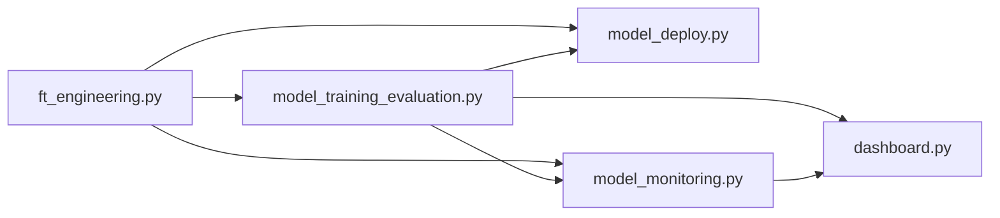

# 🧪 Credit Risk MLOps Pipeline — Rama `developer`


Esta es la **rama de integración activa** del proyecto. Aquí se fusionan las ramas `feature/*` antes de promoverse a [`main`](../../tree/main). Si buscas la documentación funcional completa del proyecto (arquitectura, resultados, endpoints), consulta el [README de `main`](../../tree/main/README.md) — este documento es específico para quien va a **modificar el código**.

---

## 📑 Índice

- [Propósito de esta rama](#-propósito-de-esta-rama)
- [Configuración del entorno de desarrollo](#-configuración-del-entorno-de-desarrollo)
- [Flujo de trabajo (GitFlow)](#-flujo-de-trabajo-gitflow)
- [Convenciones de código](#-convenciones-de-código)
- [Cómo ejecutar el pipeline localmente](#-cómo-ejecutar-el-pipeline-localmente)
- [Mapa de módulos y dependencias internas](#-mapa-de-módulos-y-dependencias-internas)
- [Puntos de extensión frecuentes](#-puntos-de-extensión-frecuentes)
- [Checklist antes de abrir un Pull Request](#-checklist-antes-de-abrir-un-pull-request)
- [Estado actual / trabajo en curso](#-estado-actual--trabajo-en-curso)

---

## 🎯 Propósito de esta rama

`developer` recibe todo el trabajo nuevo antes de que llegue a `main`. Nada se commitea directamente aquí salvo *hotfixes* triviales de documentación: el flujo esperado es `feature/<nombre>` → PR contra `developer` → revisión → merge.

## ⚙️ Configuración del entorno de desarrollo

```bash
git clone https://github.com/eremohn/credit-risk-mlops-pipeline.git
cd credit-risk-mlops-pipeline
git checkout developer

python3 -m venv .venv
source .venv/bin/activate

pip install -r requirements.txt
```

No hay variables de entorno obligatorias: todos los scripts usan rutas relativas (`../base_de_datos.csv`, `../model_artifacts/`) asumiendo ejecución desde `src/`.

## 🌳 Flujo de trabajo (GitFlow)

| Rama | Origen | Destino |
|---|---|---|
| `feature/<nombre-descriptivo>` | `developer` | `developer` |
| `fix/<nombre-descriptivo>` | `developer` (o `main` si es un hotfix urgente) | `developer` |
| `developer` | — | `main` (al cerrar un ciclo de release) |
| `certification` | *snapshot* congelado de una versión de `main` | — (no recibe merges de vuelta) |

**Convención de commits:** mensajes en español, en modo imperativo, con prefijo de tipo cuando aplique:

```text
feat: agrega validación de rango a edad_cliente en SolicitudCredito
fix: corrige clonación de CatBoostClassifier en StackingClassifier
docs: actualiza README con endpoints de model_deploy.py
refactor: extrae _obtener_parametro_para_curva_validacion
```

## 🧑‍💻 Convenciones de código

Todo el código nuevo debe respetar lo ya establecido en el proyecto (no son sugerencias, son requisitos de PR):

- **PEP 8 / PEP 257**, `type hints` en toda función pública, docstrings estilo Google.
- **`logging`, nunca `print()`.** Cada módulo configura su propio `logger = logging.getLogger("<nombre_modulo>")`.
- **`RANDOM_STATE = 42`** en cualquier proceso estocástico nuevo (splits, modelos, muestreos).
- **`try/except`** en cualquier operación de I/O o que dependa de datos externos; nunca dejar que el proceso termine sin loggear la causa.
- **Orden de archivo fijo:** imports → constantes → configuración → funciones → clases → `main()` → `if __name__ == "__main__":`.
- **DRY estricto:** si una función ya existe en `ft_engineering.py` o `model_training_evaluation.py` (p. ej. `clean_data`, `generate_features`, `load_model`, `predict`), se **importa y reutiliza** — nunca se reimplementa localmente en `model_deploy.py`, `model_monitoring.py` o `dashboard.py`. Esto no es solo estilo: es lo que garantiza la paridad train/serve del sistema.

## 🚀 Cómo ejecutar el pipeline localmente

```bash
cd src

# Entrenar (genera todos los artefactos base en ../model_artifacts/)
python model_training_evaluation.py

# Levantar la API con recarga automática para desarrollo
uvicorn model_deploy:app --reload --port 8000

# Ejecutar un ciclo de monitoreo
python model_monitoring.py

# Levantar el dashboard
streamlit run dashboard.py
```

> 💡 Para iterar rápido en `model_training_evaluation.py` sin esperar una corrida completa de Optuna, reduce temporalmente `N_TRIALS_OPTUNA`, `N_SPLITS_CV_OPTUNA` y los espacios de búsqueda de `GRID_RANDOM_FOREST_ANGOSTO` / `DISTRIBUCION_RANDOM_FOREST_AMPLIA` al inicio del archivo. **No commitear esos valores reducidos** — son solo para desarrollo local.

## 🗺️ Mapa de módulos y dependencias internas



- `ft_engineering.py` no depende de ningún otro módulo del proyecto (es la base).
- `model_training_evaluation.py` solo depende de `ft_engineering.py`.
- `model_deploy.py`, `model_monitoring.py` y `dashboard.py` importan de ambos, pero **nunca entre sí** (evita acoplamiento circular entre el servicio de inferencia, el job de monitoreo y el dashboard).

## 🔧 Puntos de extensión frecuentes

| Quiero... | Modificar |
|---|---|
| Agregar una variable derivada nueva | `generate_features()` en `ft_engineering.py`, y añadirla a `COLUMNAS_NUMERICAS_MODELO`/`COLUMNAS_CATEGORICAS_MODELO` |
| Agregar una familia de modelo nueva | Seguir el patrón `train_<modelo>()` + `_construir_objetivo_<modelo>()` de `model_training_evaluation.py` |
| Cambiar el umbral de decisión del semáforo | `UMBRAL_SEMAFORO_VERDE` / `UMBRAL_SEMAFORO_AMARILLO` en `dashboard.py` (y `UMBRAL_DECISION` en `model_deploy.py` si afecta la clase dura) |
| Agregar un endpoint a la API | `model_deploy.py`, reutilizando `generar_predicciones()` — no dupliques la lógica de scoring |
| Cambiar los umbrales de severidad de drift | `UMBRAL_PSI_MODERADO` / `UMBRAL_PSI_SEVERO` en `model_monitoring.py` |

## ✅ Checklist antes de abrir un Pull Request

- [ ] El script modificado corre de punta a punta contra `base_de_datos.csv` real (no solo se revisó el código).
- [ ] Ninguna función nueva usa `print()`.
- [ ] Toda función pública nueva tiene type hints y docstring estilo Google.
- [ ] Si se tocó `ft_engineering.py`, se verificó que `model_training_evaluation.py`, `model_deploy.py` y `model_monitoring.py` siguen funcionando (comparten funciones).
- [ ] Si se agregó una dependencia, se actualizó `requirements.txt` con la versión exacta instalada.
- [ ] `N_TRIALS_OPTUNA` y demás constantes de producción quedaron en sus valores originales (no en los reducidos para pruebas locales).

## 📌 Estado actual / trabajo en curso

- ✅ `ft_engineering.py`, `model_training_evaluation.py`, `model_deploy.py`, `model_monitoring.py`, `dashboard.py`: implementados y validados end-to-end contra datos reales.
- 🚧 Sin `Dockerfile` ni pipeline de CI/CD todavía — ver el [roadmap del README principal](../../tree/main/README.md#-próximas-mejoras).
- 🚧 Sin suite de tests automatizados (`pytest`) — toda la validación actual fue manual, ejecutando cada script contra el dataset real.
